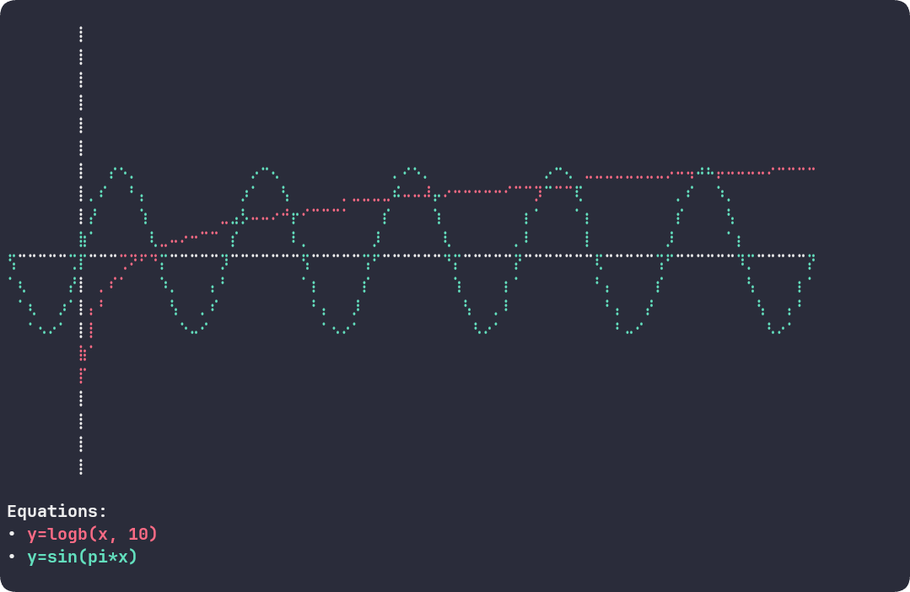

**eqdraw** is a simple yet powerful command-line tool that lets you visualize mathematical functions directly in your terminal using Unicode characters.



## ⚙️ Install

You'll need [Rust and Cargo](https://www.rust-lang.org/tools/install) installed on your system. Then, run the following command:

```bash
cargo install eqdraw
```

## 🚀 Quick Usage

Using `eqdraw` is straightforward. Here are a few examples:

**1. Plot a single equation:**

```bash
eqdraw -q "y=x^2"
```

**2. Plot multiple equations on the same graph:**

```bash
eqdraw -q "y=sin(x)" -q "y=cos(x)"
```

**3. Customize the view range:**

Focus on a specific part of the graph by defining the min/max values for the axes.

```bash
eqdraw -q "y=tan(x)" --xmin -3.14 --xmax 3.14 --ymin -2 --ymax 2
```

## 📝 Equation Syntax

Equations must follow the format `y=<expression_in_x>`.

### Operators

| Operator | Description |
| :--- | :--- |
| `+` | Addition |
| `-` | Subtraction |
| `*` | Multiplication |
| `/` | Division |
| `^` | Power |

### Constants

| Name | Value |
| :--- | :--- |
| `pi` | The mathematical constant Pi (π ≈ 3.14159) |
| `e` | Euler's number (e ≈ 2.71828) |

### Functions

| Function | Description |
| :--- | :--- |
| `sqrt(x)` | The square root of x |
| `exp(x)` | e raised to the power of x |
| `pow(b, e)`| b raised to the power of e |
| `root(x, n)`| The nth root of x |
| `abs(x)` | The absolute value of x |
| `sin(x)`, `cos(x)`, `tan(x)` | Basic trigonometric functions |
| `cot(x)`, `sec(x)`, `csc(x)` | Cotangent, secant, cosecant |
| `asin(x)`, `acos(x)`, `atan(x)` | Inverse trigonometric functions (arcsin, etc.) |
| `acot(x)`, `asec(x)`, `acsc(x)` | Arccotangent, arcsecant, arccosecant |
| `sinh(x)`, `cosh(x)`, `tanh(x)` | Hyperbolic functions |
| `coth(x)`, `sech(x)`, `csch(x)` | Hyperbolic cotangent, secant, cosecant |
| `asinh(x)`, `acosh(x)`, `atanh(x)`| Inverse hyperbolic functions (arsinh, etc.) |
| `acoth(x)`, `asech(x)`, `acsch(x)`| Inverse hyperbolic cotangent, secant, cosecant |
| `ln(x)` | The natural logarithm of x (base e) |
| `log(x)` | The base-10 logarithm of x |
| `logb(x, b)`| The logarithm of x with base b |
| `floor(x)`| Rounds x down to the nearest integer |
| `ceil(x)` | Rounds x up to the nearest integer |
| `round(x)`| Rounds x to the nearest integer |

## 🔧 Command-line Options

| Option | Alias | Description |
| :--- | :--- | :--- |
| `----queries <equation>` | `-q` | The equation to plot. Can be used multiple times. |
| `--xmin <XMIN>` | | Minimum value for the x-axis. |
| `--xmax <XMAX>` | | Maximum value for the x-axis. |
| `--ymin <YMIN>` | | Minimum value for the y-axis. |
| `--ymax <YMAX>` | | Maximum value for the y-axis. |
| `--help` | `-h` | Show the help message. |
| `--version` | `-V` | Show the version information. |

## 💡 Inspiration

This project was inspired by the fantastic Python library [plotille](https://github.com/tammoippen/plotille) by Tammo Ippen.

## 🤝 Contributing

Contributions are welcome! If you have an idea for an improvement or a bug fix, please open an Issue or a Pull Request on the repository.
